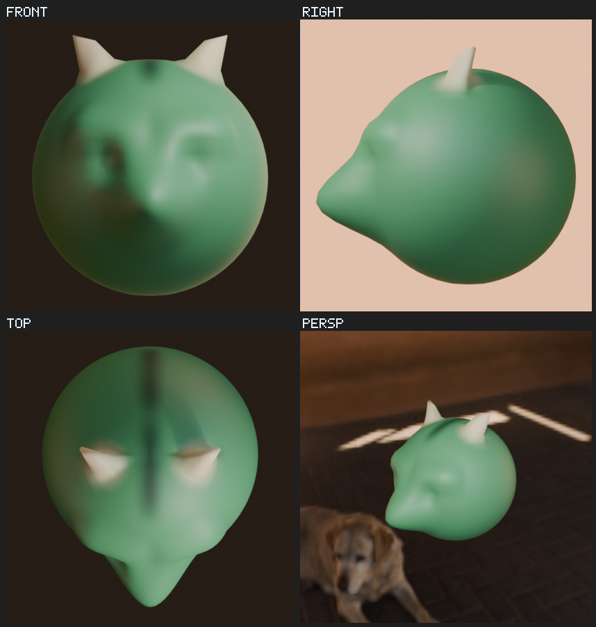
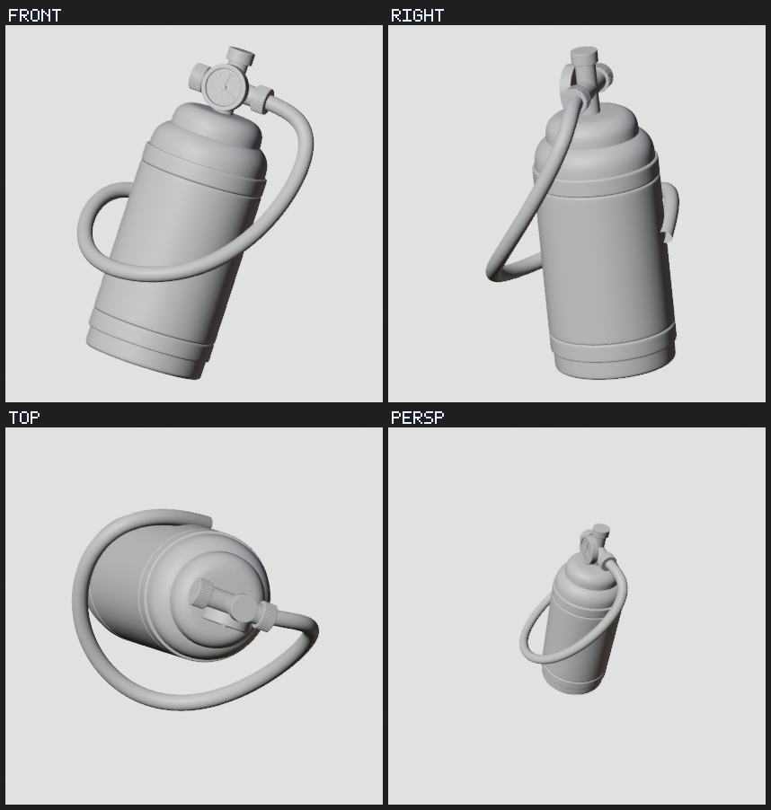

# Ghostblend

**Headless Blender for AI agents, with a built-in MCP server.**

[Bahasa Indonesia](README.id.md)


*Nine icons from one production `.blend` file, driven entirely over MCP. Ghostblend
opened the file, reported that every product collection was switched off, and
the agent switched them on one at a time and rendered each with Cycles on the
GPU, through the file's own camera and lights, in about 5 seconds per icon.
Nothing opened on screen. The blue tiles were added for this page.*

Ghostblend is one executable. It speaks the [Model Context Protocol](https://modelcontextprotocol.io)
on stdio, and behind it runs a full Blender with no window. Your AI agent gets
typed tools to model, sculpt, paint, light, animate, bake, import and export,
and render, and it sees its work as images. You do not need to install
Blender, open it, or add an add-on.

---

## Contents

- [Why it exists](#why-it-exists)
- [What an agent can do](#what-an-agent-can-do)
- [Quick start](#quick-start)
- [Connect your agent](#connect-your-agent)
- [Blender feature coverage](#blender-feature-coverage)
- [Tool reference](#tool-reference)
- [How it works](#how-it-works)
- [The Blender engine](#the-blender-engine)
- [Configuration](#configuration)
- [Troubleshooting](#troubleshooting)
- [Performance](#performance)
- [Security](#security)
- [Development](#development)
- [Status and limitations](#status-and-limitations)

---

## Why it exists

### The idea

People who build with AI agents often need what Blender can *do*: modelling,
modifiers, materials, format conversion, mesh repair, rendering. They do not
need Blender's interface. An agent cannot use a GUI anyway. So the idea is simple:
run Blender headless in the background and connect it to the agent over MCP,
the standard way agents talk to tools.

### What was missing

When this project started, in September 2026, the options for connecting an
agent to Blender looked like this:

| Option | How it works | What that means for an agent |
|---|---|---|
| MCP for Blender, the most popular community server | An add-on inside a running Blender window, reached over a local socket | Someone has to install the add-on and keep Blender open on screen |
| The official Blender Lab MCP server | An add-on inside a running Blender window, plus a relay process; needs Blender 5.1+ | Same as above. Its six headless `_for_cli` tools start a fresh Blender for every call, so nothing carries over between calls and each call pays Blender's start-up time |
| Small headless servers | Run a Python string in `blender -b`, write a file | The agent is blind, there is no undo, and a crash or hang ends the session |

Each approach leaves an agent with at least one of these problems:

- **It cannot see.** An agent working headless has no viewport. Without images
  it builds by guesswork.
- **It forgets.** Starting Blender for every call costs about two seconds and
  throws away the scene unless the agent saves and reloads by hand.
- **It cannot undo.** Blender's undo does not exist in background mode, so one
  bad script corrupts the scene for every call after it.
- **It gets stuck.** A long render or a runaway loop blocks everything, and a
  crash takes the work with it.
- **It is a chore to set up.** Add-ons, open windows, Python environments.

### What Ghostblend does about it

| Problem | Ghostblend's answer |
|---|---|
| Cannot see | `render_preview` returns a labelled multi-view image inside the tool result |
| Forgets | One Blender stays alive for the whole session; the scene persists between calls |
| Cannot undo | Every scene change is autosaved. A failed change rolls back automatically, and `checkpoint_restore` steps back any number of changes |
| Gets stuck | Runaway Python is interrupted; a hang or crash restarts Blender and restores the last autosave. Final renders run as separate background jobs |
| Setup chore | One executable. It downloads its own Blender engine the first time, or uses one you already have |

### Design principles

- **Blender stays Blender.** Ghostblend never rewrites or patches Blender. It
  runs the unmodified official build as a subprocess. Rewriting a program of
  millions of lines would be neither possible nor useful; the value is in the
  layer between the agent and Blender.
- **The agent should never lose work.** Autosave, rollback, and restore are on
  by default.
- **Errors should teach.** Arguments are validated before they reach Blender.
  A typo such as `widht` comes back as "did you mean 'width'?", and a missing
  object name lists the closest matches.
- **Nothing should linger.** If the server is killed, every Blender process it
  started exits within seconds.

---

## What an agent can do

Ask for something in plain language, for example:

> Make a small table with four legs and a wooden-looking top, show me all four
> views, check it is watertight, and export it as `table.glb`.

The agent then calls tools such as:

```text
scene_new
add_primitive    type=cube  name=Top   size=1  scale=[1.2, 0.8, 0.05]  location=[0, 0, 0.75]
add_primitive    type=cube  name=Leg1  size=1  scale=[0.05, 0.05, 0.72] location=[0.55, 0.35, 0.36]
object_duplicate name=Leg1  new_name=Leg2  location=[-0.55, 0.35, 0.36]
...
material_set     object=Top  base_color=[0.55, 0.35, 0.2, 1]  roughness=0.6
render_preview                          the image comes back and the agent looks at it
validate         objects=[Top, Leg1, ...]
export_model     path=table.glb
```

Typical uses:

- **Asset pipelines:** convert between glTF, FBX, OBJ, STL, PLY, USD and
  Alembic; apply modifiers; decimate; validate before shipping to a game engine.
- **3D printing prep:** find non-manifold edges, holes, flipped normals and
  unapplied scale, then export STL.
- **Procedural modelling from text:** build scenes from primitives, Edit Mode
  operations and modifiers, iterating with previews.
- **Sculpting and painting:** shape organic forms with sculpt brushes and colour
  them with vertex or texture painting, then bake to textures.
- **Product and concept renders:** set materials and lights, then render with
  EEVEE or Cycles on your GPU.
- **Anything else Blender can do:** `run_python` gives full `bpy` access, and
  `api_describe` / `api_search` read the running Blender's own API so the agent
  gets names right the first time.

---

## Quick start

### 1. Install

There are no prebuilt downloads yet, so you build Ghostblend from source. You
need a [Rust toolchain](https://rustup.rs). From the repository folder:

```bash
cargo install --path .
```

This builds a release binary and puts `ghostblend` on your PATH:

| System | Installed at |
|---|---|
| Windows | `C:\Users\<you>\.cargo\bin\ghostblend.exe` |
| macOS, Linux | `~/.cargo/bin/ghostblend` |

Prefer to keep it inside the repository? `cargo build --release` puts the same
binary in `target/release/` instead.

### 2. Install the engine (optional)

```bash
ghostblend setup
```

This downloads Blender 5.1.2 (414 MB) from download.blender.org, verifies it
against a pinned SHA-256, and unpacks it into Ghostblend's data folder. You can
skip this step: the server does the same thing automatically the first time it
needs Blender, and if you already have Blender 4.2 or newer installed it uses
that and downloads nothing.

### 3. Check it

```bash
ghostblend doctor
```

```text
[ok] Engine in use: C:\Program Files\Blender Foundation\Blender 5.1\blender.exe
[ok] Blender version: 5.1.1
[ok] Worker ready in 1.86s (Blender 5.1.1, Python 3.13.9)
[ok] Render engines: BLENDER_WORKBENCH, BLENDER_EEVEE, CYCLES
[ok] Cycles GPU: NVIDIA GeForce RTX 4070 (CUDA), NVIDIA GeForce RTX 4070 (OPTIX)
[ok] render_preview (256px) in 0.74s
```

### 4. Connect your agent

Add Ghostblend to your AI app. The fastest route is Claude Code:

```bash
claude mcp add --scope user ghostblend -- ghostblend
```

Every other app is covered step by step in [Connect your agent](#connect-your-agent).

### 5. Try it

Start a new chat or session and ask:

> Use Ghostblend to add a monkey head with a gold material, then show me a preview.

The agent should call `add_primitive`, `material_set` and `render_preview`, and
the four-view image appears in the chat.

---

## Connect your agent

Ghostblend is a local MCP server. Your AI app starts it in the background and
talks to it over stdio, so you never run it by hand. You only tell the app where
the executable is. No arguments are needed, because `serve` is the default.

**Before you start:**

- **Run `ghostblend setup` once** if you do not have Blender 4.2+ installed. The
  first engine download is 414 MB. Tools work during the download, but they only
  answer with its progress until it finishes.
- **Use the full path in desktop apps.** Command-line tools find `ghostblend`
  on your PATH. Desktop apps often start with a shorter PATH, so give them the
  full path from the table in [Install](#1-install).
- **Escape backslashes in JSON.** Write `C:\\Users\\you\\.cargo\\bin\\ghostblend.exe`
  or `C:/Users/you/.cargo/bin/ghostblend.exe`.

| App | Supported | Where you configure it |
|---|---|---|
| [Claude Code](#claude-code) | yes | `claude mcp add` |
| [Claude Desktop](#claude-desktop) | yes | `claude_desktop_config.json` |
| [ChatGPT desktop app and Codex](#chatgpt-desktop-app-and-codex) | yes | `~/.codex/config.toml` |
| [ChatGPT on the web](#chatgpt-on-the-web) | not yet | needs a remote server |
| [Cursor](#cursor) | yes | `mcp.json` |
| [VS Code with GitHub Copilot](#vs-code-with-github-copilot) | yes | `mcp.json` |
| [Devin Desktop, formerly Windsurf](#devin-desktop-formerly-windsurf) | yes | `mcp_config.json` |
| [Gemini CLI](#gemini-cli) | yes | `gemini mcp add` |
| [Zed](#zed) | yes | `settings.json` |
| [Other apps](#other-apps) | usually | their MCP settings |

### Claude Code

```bash
claude mcp add --scope user ghostblend -- ghostblend
```

`--scope user` makes Ghostblend available in all your projects. Leave it out to
add it to the current project only, or use `--scope project` to write a
`.mcp.json` you can commit for your team.

Check it inside a session with `/mcp`, or from the terminal:

```bash
claude mcp list
```

Remove it with `claude mcp remove ghostblend`.

### Claude Desktop

1. Open the **Claude** menu in the system menu bar, not the settings inside the
   chat window, and choose **Settings**.
2. Go to **Developer** and click **Edit Config**. This opens
   `claude_desktop_config.json`:
   - Windows: `%APPDATA%\Claude\claude_desktop_config.json`
   - macOS: `~/Library/Application Support/Claude/claude_desktop_config.json`
3. Add Ghostblend under `mcpServers`, keeping any servers already there:

   ```json
   {
     "mcpServers": {
       "ghostblend": {
         "command": "C:\\Users\\you\\.cargo\\bin\\ghostblend.exe"
       }
     }
   }
   ```

   On macOS use `"/Users/you/.cargo/bin/ghostblend"`.
4. Quit Claude Desktop completely and open it again.
5. In a chat, click the **+** button, open **Connectors**, and check that
   **ghostblend** is listed and switched on.

If it does not appear, read the server log, which contains Ghostblend's own
messages:

- Windows: `%APPDATA%\Claude\logs\mcp-server-ghostblend.log`
- macOS: `~/Library/Logs/Claude/mcp-server-ghostblend.log`

### ChatGPT desktop app and Codex

The ChatGPT desktop app, the Codex CLI and the Codex IDE extension share one MCP
configuration, so adding Ghostblend once makes it available in all three.

With the Codex CLI:

```bash
codex mcp add ghostblend -- ghostblend
```

Or edit `~/.codex/config.toml` yourself (`C:\Users\<you>\.codex\config.toml` on
Windows):

```toml
[mcp_servers.ghostblend]
command = 'C:\Users\you\.cargo\bin\ghostblend.exe'
tool_timeout_sec = 300
```

The single quotes make TOML take the Windows path literally. Codex stops a tool
call after 60 seconds by default; `tool_timeout_sec = 300` gives short final
renders with `wait=true` time to finish. You can also add the server from the
ChatGPT desktop app's MCP settings, which write to the same file.

### ChatGPT on the web

Not supported yet. ChatGPT in the browser only connects to remote MCP servers
over HTTPS and cannot start a program on your computer, while Ghostblend
currently runs locally over stdio. Use the ChatGPT desktop app instead, as
described above.

Do not work around this by exposing Ghostblend through a public tunnel:
`run_python` would then let anyone who finds the URL run code on your machine.
An HTTP transport with authentication is on the roadmap.

### Cursor

Edit `~/.cursor/mcp.json` for all projects, or `.cursor/mcp.json` in a project:

```json
{
  "mcpServers": {
    "ghostblend": {
      "command": "C:\\Users\\you\\.cargo\\bin\\ghostblend.exe"
    }
  }
}
```

Then open Cursor's MCP settings and make sure the **ghostblend** toggle is on.

### VS Code with GitHub Copilot

Run **MCP: Open User Configuration** from the Command Palette, or create
`.vscode/mcp.json` in a workspace. VS Code uses `servers` as the top-level key:

```json
{
  "servers": {
    "ghostblend": {
      "type": "stdio",
      "command": "C:\\Users\\you\\.cargo\\bin\\ghostblend.exe"
    }
  }
}
```

The Command Palette's **MCP: Add Server** walks you through the same thing.
Use Copilot Chat in **Agent** mode to call the tools.

### Devin Desktop, formerly Windsurf

Windsurf was renamed Devin Desktop in June 2026. In the Cascade panel, open the
**...** menu, go to the MCP section, and choose **Open MCP config file**. That
opens the right file for your version:

- Windows: `%APPDATA%\devin\mcp_config.json`
- macOS, Linux: `~/.config/devin/mcp_config.json`
- Older Windsurf builds: `~/.codeium/windsurf/mcp_config.json`

```json
{
  "mcpServers": {
    "ghostblend": {
      "command": "C:\\Users\\you\\.cargo\\bin\\ghostblend.exe"
    }
  }
}
```

Save the file, then switch **ghostblend** on in the MCP list.

### Gemini CLI

```bash
gemini mcp add --scope user ghostblend ghostblend
```

The first `ghostblend` is the name and the second is the command. Or edit
`~/.gemini/settings.json`:

```json
{
  "mcpServers": {
    "ghostblend": {
      "command": "ghostblend"
    }
  }
}
```

### Zed

Open **Settings**, then **AI**, then **MCP Servers**, and choose **Add Server**
and **Add Local Server**, or edit `settings.json` directly:

```json
{
  "context_servers": {
    "ghostblend": {
      "command": "C:\\Users\\you\\.cargo\\bin\\ghostblend.exe",
      "args": [],
      "env": {}
    }
  }
}
```

### Other apps

Most other MCP apps, such as Cline, Continue and LM Studio, accept the same
`mcpServers` shape shown for Cursor. If an app asks for a command, give it the
full path to `ghostblend`; if it asks for a transport, choose **stdio**. If the
app stops tool calls after a short time, avoid `render` with `wait=true` and let
the agent poll `job_status` instead.

---

## Blender feature coverage



*Sculpted from a sphere with the `sculpt` tool (horns, snout, brow, eye sockets,
mirrored), painted with `paint`, and lit with `world_set` and `light_set`. No
Blender window was involved.*

Every area below was checked on Blender 5.1 in background mode, and the checks
live on as regression tests in
[`tests/bridge/test_capabilities.py`](tests/bridge/test_capabilities.py). Each test
asserts a real effect: geometry changed, pixels lit, bones weighted, a file
written.

| Area | What works headless | How the agent reaches it |
|---|---|---|
| Modelling | Primitives; Edit Mode extrude, inset, bevel, subdivide, loop cut, bisect, spin, merge, delete, dissolve, normals, triangulate, shading; all modifiers and booleans; curves, 3D text, metaballs, NURBS; geometry nodes; voxel and QuadriFlow remesh; join | `add_primitive`, `edit_mesh`, `modifier_add`, `run_python` |
| Sculpting | Draw, clay, inflate, smooth, flatten, pinch, grab, crease and noise brushes; mirror symmetry; voxel remesh and subdivision for detail; Multires and Dyntopo | `sculpt`, `run_python` |
| Lighting | Point, sun, spot and area lights; HDRI environments, eight bundled with Blender or your own; emission; light linking | `light_set`, `world_set`, `material_set` |
| Colouring and texturing | Principled materials; image and procedural textures; vertex colours; vertex and texture painting; UV unwrapping with seven methods; texture baking of nine kinds, including high-poly to low-poly | `material_set`, `paint`, `edit_mesh`, `bake` |
| Rendering | Workbench, EEVEE, Cycles on CPU and GPU (OptiX tested; CUDA, HIP, oneAPI and Metal are used when present); denoising; depth of field; motion blur; Freestyle lines; the compositor; PNG, JPEG, EXR, multilayer EXR and MP4 | `render`, `render_preview`, `run_python` |
| Animation and rigging | Keyframes on any property; drivers; shape keys; constraints; armatures with automatic weights; pose keyframes | `animate`, `run_python` |
| Simulation | Rigid body, cloth, soft body, particles, Mantaflow fluid baking | `run_python` |
| Grease Pencil | Strokes, materials, rendering | `run_python` |
| Video editing | Sequencer strips, text, rendering to video | `run_python` |
| Motion tracking | Movie clips and tracks; camera solving needs real footage and was not tested | `run_python` |
| Pipeline | glTF, FBX, OBJ, STL, PLY, USD, Alembic; append and link from other `.blend` files; asset marking | `import_model`, `export_model`, `run_python` |

### What headless Blender cannot do, and what to use instead

A few Blender features exist only inside its interactive interface. Background
mode either refuses them or, in two cases, crashes. Ghostblend covers each one
another way, and blocks the two crashing operators in `run_python` with a hint
instead of letting them take Blender down.

| Blender feature | What happens headless | Use instead |
|---|---|---|
| Sculpt brush strokes | Refused: needs the viewport | `sculpt` |
| Sculpt mesh filter | Crashes Blender; Ghostblend blocks it | `sculpt` without points |
| Vertex and texture paint strokes | Refused: needs the viewport | `paint` |
| Loop cut operator | Crashes Blender; Ghostblend blocks it | `edit_mesh` with `loop_cut` |
| Knife and knife project | Refused: needs the viewport | `edit_mesh` with `bisect`, or a boolean modifier |
| Viewport (OpenGL) render and screenshots | Refused: no window | `render_preview`, or `render` with Workbench |
| Modal tools, gizmos, UI panels | Do not exist without a UI | Typed tools and `run_python` set exact values |

When another operator refuses to run for lack of a viewport, the error that
comes back says so and suggests the tool to use.

---

## Tool reference

Distances are metres and rotations are degrees. Colours are RGBA floats from 0
to 1 in Blender's linear colour space, the same values Blender stores, so they
look lighter on screen after the view transform. Tools marked "autosaved" change
the scene. If one fails, the scene rolls back to how it was before the call.

### Scene

| Tool | Autosaved | What it does |
|---|---|---|
| `scene_new` | yes | Start an empty scene, or Blender's default cube, camera and light with `keep_defaults` |
| `scene_open` | yes | Open a `.blend` file |
| `scene_save` | | Save to a `.blend`; with no path, save back to the file opened or last saved |
| `scene_info` | | Every object with transform and mesh counts, plus camera, world, frame range, render settings and units |
| `object_info` | | One object in full: modifiers with their settings, materials, world bounding box, UVs, custom properties |

### Building

| Tool | Autosaved | What it does |
|---|---|---|
| `add_primitive` | yes | cube, uv_sphere, ico_sphere, cylinder, cone, torus, plane, circle, monkey, grid, empty, camera, light |
| `transform` | yes | Set or offset location, rotation and scale; `apply` bakes the transform into the mesh |
| `object_delete` | yes | Delete objects by name; unknown names are reported, not fatal |
| `object_duplicate` | yes | Copy an object, as an independent copy or a linked instance |
| `modifier_add` | yes | subdivision, mirror, array, boolean, bevel, solidify, decimate, triangulate, weld, displace, remesh, wireframe, screw, smooth, edge_split; `params` are checked against Blender's own settings |
| `modifier_apply` | yes | Bake one modifier, or all of them, into the mesh |
| `material_set` | yes | Principled BSDF: base colour, metallic, roughness, IOR, alpha, transmission, emission, image texture. Without a name it edits the material already on the object |
| `edit_mesh` | yes | Edit Mode operations on selected faces: extrude, inset, bevel, subdivide, loop_cut, bisect, spin, merge, delete, dissolve, flip_normals, recalc_normals, triangulate, shade_smooth, shade_flat, unwrap, mark_seams. Faces are selected by direction (`facing`), world box, material slot or index |

### Sculpting and painting

| Tool | Autosaved | What it does |
|---|---|---|
| `sculpt` | yes | Brushes draw, clay, inflate, smooth, flatten, pinch, grab, crease, noise. A stroke is a list of world-space points stamped with a radius, strength and falloff, with optional mirror symmetry. Without points, smooth, inflate and noise act on the whole mesh. `subdivide` or `remesh` add the density sculpting needs |
| `paint` | yes | Paint vertex colours or an image texture through the UVs, by stroke or by filling selected faces, with mix, add, multiply, subtract, lighten and darken. Creates the colour layer or texture and connects it to the material |

### Lighting

| Tool | Autosaved | What it does |
|---|---|---|
| `world_set` | yes | World background colour and strength, or an HDRI (city, courtyard, forest, interior, night, studio, sunrise, sunset, or your own file) with rotation |
| `light_set` | yes | Create or edit a light by name: type, power, colour, size, sun angle, spot cone and blend, shadows, position, and `look_at` aiming |

### Baking and animation

| Tool | Autosaved | What it does |
|---|---|---|
| `bake` | yes | Cycles bake into a texture: diffuse, combined, ao, normal, emit, roughness, shadow, glossy, position. `source` bakes a high-poly model onto this one; `assign` connects the result to the material |
| `animate` | yes | Keyframes on any animatable property, such as `location`, `rotation_deg`, `data.energy` or `modifiers["Bevel"].width`, with bezier, linear or constant interpolation |

### Files

| Tool | Autosaved | What it does |
|---|---|---|
| `import_model` | yes | glTF/GLB, FBX, OBJ, STL, PLY, USD, Alembic; format from the extension |
| `export_model` | | Same formats; the whole scene or a selection; applies modifiers by default |

### Seeing and rendering



*What the agent sees: one `render_preview` call returns these four views of the
oxygen tank as a single image, in 2.4 seconds on this production file.*

| Tool | What it does |
|---|---|
| `render_preview` | Quick images returned inline: by default a 2x2 sheet of front, right, top and perspective. `shading` is solid, textured or rendered; `objects` frames a subset. Never changes the scene |
| `render` | Final render of a still or an animation with Workbench, EEVEE or Cycles on GPU or CPU, as PNG, JPEG, EXR, multilayer EXR or MP4. Runs as a background job and returns a job id; `wait=true` blocks for short stills |
| `job_status` | State, progress percent, recent log lines, output files; `include_image` returns the finished picture |
| `job_cancel` | Stop a queued or running render |

### History

| Tool | Autosaved | What it does |
|---|---|---|
| `checkpoint_save` | | Save a named snapshot of the whole scene |
| `checkpoint_list` | | Named checkpoints plus the autosave history, one entry per change |
| `checkpoint_restore` | yes | Go back to a checkpoint, a specific autosave, or `steps=N` changes ago |

### Inspecting and scripting

| Tool | Autosaved | What it does |
|---|---|---|
| `validate` | | Non-manifold and boundary edges, loose and duplicate vertices, n-gons, zero-area faces, inconsistent normals, unapplied or negative scale, unapplied rotation, missing UVs, missing textures, objects far from the origin |
| `run_python` | yes | Run `bpy` code in the live scene; assign to `result` to return JSON. Interrupted after `timeout_s` (default 60) |
| `api_describe` | | Parameters, types, defaults, ranges and enum values of an operator or type, read from Blender's RNA |
| `api_search` | | Find operators and types by keyword |

---

## How it works

```text
AI agent (Claude Code, Cursor, ...)
        |  MCP: JSON-RPC over stdio
        v
+----------------------- ghostblend (Rust) -----------------------+
|  MCP server       tool schemas, argument checks, image encoding |
|  Supervisor       starts Blender, one call at a time, timeouts, |
|                   restart and restore after a crash or hang     |
|  Render jobs      one separate Blender per render, progress     |
|  Engine manager   finds, or downloads and verifies, Blender     |
+------------+-------------------------------------+--------------+
             | JSON lines over stdin/stdout        | per render job
             v                                     v
   blender -b --python bridge            blender -b scene.blend
   (one persistent worker)               (exits when the job ends)
```

**The Rust side** owns everything about the protocol and the processes: the MCP
server, the JSON Schema of every tool, argument validation, timeouts, restarts,
render jobs, image encoding, and finding or installing the engine.

**The Python bridge** is embedded in the executable and written into a
per-session folder at start-up. It runs inside Blender, reads requests on a
background thread, and executes them with `bpy` on Blender's main thread. It
knows nothing about MCP.

**Protocol hygiene.** Replies travel on a private copy of Blender's original
stdout. Everything else that Blender or an agent's script prints goes to stderr,
so stray output can never be mistaken for a reply.

**Safety net.** After every scene-changing command the bridge saves a copy of
the scene to `autosave/NNNNNN.blend` and keeps the last ten. If a command fails,
it reopens the previous autosave, so a retry starts clean. If Blender hangs past
the timeout, Ghostblend first interrupts Python code; if that does not work it
kills Blender, starts a new one, and restores the latest autosave. The old
process is always dead before the new one starts, so two Blenders never write
the same files.

**Render jobs** run as their own `blender -b` processes against a snapshot of
the scene, so a long render never blocks the agent's other work. Up to two run
at once, each is capped at one hour, and each watches its stdin: when Ghostblend
exits, even abruptly, the renders exit too.

The full design, with the reasoning behind each decision, is in
[`docs/superpowers/specs/2026-09-29-ghostblend-design.md`](docs/superpowers/specs/2026-09-29-ghostblend-design.md)
and the build plan is in [`docs/superpowers/plans/`](docs/superpowers/plans/).
Both are written in Indonesian.

---

## The Blender engine

Ghostblend needs Blender to do the actual 3D work, but you do not have to
install it. Ghostblend looks for an engine in this order:

1. `--blender <path>` or the `GHOSTBLEND_BLENDER` variable, if you set one. This
   is never silently replaced by something else.
2. A `blender/` folder next to the `ghostblend` executable, for offline bundles.
3. Ghostblend's own engine in its data folder.
4. An installed Blender 4.2 or newer. Older installs are skipped.
5. Otherwise, it downloads its own engine.

### Ghostblend's own engine

| | |
|---|---|
| Version | Blender 5.1.2, the official portable build, unmodified |
| Source | download.blender.org |
| Check | SHA-256 pinned in the source code, taken from Blender's published checksums |
| Download | 414 MB, once; an interrupted download resumes where it stopped |
| On disk | about 1.2 GB |
| Location | `%LOCALAPPDATA%\ghostblend\rt\5.1.2` on Windows, `~/.local/share/ghostblend/rt/5.1.2` on Linux |
| Platforms | Windows x64, Windows ARM64, Linux x64 |

While the engine downloads, the server is already running. Tool calls answer
with progress such as "downloading 43% (178 of 414 MB)", so the agent knows to
try again shortly. A stalled connection is detected after 60 seconds and
retried up to four times. A corrupt file fails the checksum and is deleted. The
engine counts as installed only after it has been fully unpacked.

`--runtime managed` always uses Ghostblend's own engine, even if Blender is
installed. `--runtime system` only uses an installed Blender. `--no-download`
turns off automatic downloads.

### Offline bundle

To ship Ghostblend to a machine without internet, unzip the official portable
Blender build into a folder named `blender` next to the executable:

```text
ghostblend/
  ghostblend.exe
  blender/
    blender.exe
    5.1/ ...
```

---

## Configuration

| Flag | Meaning |
|---|---|
| `--blender <path>` | Use this Blender instead of the engine |
| `--runtime <auto\|managed\|system>` | Where the engine comes from (default `auto`) |
| `--no-download` | Never download the engine automatically |
| `--workdir <dir>` | Base directory for relative paths (default: the current directory) |
| `--session-dir <dir>` | Exact folder for this session's autosaves, previews and renders |
| `--resume <id>` | Continue an earlier session and restore its latest autosave |
| `--ephemeral` | Delete the session folder when the server exits |
| `--autosave-keep <n>` | Autosaves kept per session (default 10) |
| `--max-jobs <n>` | Render jobs running at the same time (default 2) |
| `--log-file <file>` | Write logs to a file instead of stderr |

| Environment variable | Meaning |
|---|---|
| `GHOSTBLEND_BLENDER` | Same as `--blender` |
| `GHOSTBLEND_HOME` | Move the data folder (engine and sessions) |
| `GHOSTBLEND_LOG` | Log level, for example `debug` |

Commands: `ghostblend` or `ghostblend serve` runs the MCP server,
`ghostblend setup` installs the engine, and `ghostblend doctor` checks everything.

---

## Troubleshooting

Start with `ghostblend doctor`. It shows which engine is in use and whether it
starts and renders.

| Symptom | What to do |
|---|---|
| The app does not list ghostblend | Use the full path to the executable, fully restart the app, and read its MCP log (see [Claude Desktop](#claude-desktop)) |
| Tools say the engine is being set up | Wait for the first download to finish, or run `ghostblend setup` in a terminal to watch progress |
| The download stopped | Run `ghostblend setup` again; it resumes |
| "Blender executable not found at ..." | The path in `--blender` or `GHOSTBLEND_BLENDER` is wrong. Fix it, or remove it to use the engine |
| "cannot download its engine automatically on this platform" | On macOS, install Blender 4.2+ and pass `--blender` |
| A command "timed out" | Blender was restarted and your scene restored. Use `checkpoint_list` to see where you are |
| A preview or render of an opened file is empty | The file keeps its objects in collections excluded from the view layer, a common way to switch assets on for rendering. The notes in `scene_info` and `render_preview` name those collections and give the line to include one |
| An old Blender is picked up | Versions below 4.2 are skipped. Use `--runtime managed` to always use the engine |
| You need detail | Run with `GHOSTBLEND_LOG=debug`, or `--log-file ghostblend.log` |

Session folders live in `<data>/s/<id>`, next to the engine. Each holds the
autosaves, previews and default render outputs of one server run.

---

## Performance

Measured on Windows 11 with an RTX 4070 and an i5-13400F, Blender 5.1.

| Operation | Time |
|---|---|
| Worker start, from launch to ready | 1.9 to 2.8 s, once per session |
| A typical tool call (add, transform, material) | 10 to 20 ms |
| `render_preview`, one 256 px view | 0.7 to 0.9 s |
| `render_preview`, four 420 px views | 1.5 s |
| Autosave of a small scene | about 5 ms |
| Export of a small scene to glTF | 0.4 s |

---

## Security

`run_python` runs code the agent writes, with the full power of Blender's Python
on your machine, like any scripting tool. Use Ghostblend with agents and inputs
you trust. Ghostblend speaks MCP over stdio only, so it can do nothing beyond
what the agent's own process could already do; it opens no network port. The
engine download goes only to download.blender.org and is checked against a
pinned hash.

---

## Development

```text
src/            Rust: MCP server, supervisor, render jobs, engine manager
bridge/         Python bridge that runs inside Blender (embedded at build time)
tests/bridge/   Bridge tests, executed inside Blender
tests/e2e/      End-to-end test that speaks MCP to the built executable
docs/           Design spec, build plan, images
```

| Test layer | Command | Count |
|---|---|---|
| Rust unit tests | `cargo test --lib` | 48 |
| Supervisor against real Blender | `cargo test --test worker_integration` | 6 |
| Bridge inside Blender, including the capability matrix | `blender -b --factory-startup --python tests/bridge/run_tests.py` | 172 |
| End to end over MCP | `python tests/e2e/mcp_e2e.py --binary target/release/ghostblend.exe --stage render` | 30 checks |

The end-to-end test covers invalid arguments, a missing Blender, parallel calls,
inline preview images, render jobs, cancellation, every modelling, sculpting,
painting, lighting, baking and animation tool, the crash guard, and that no
Blender process survives when Ghostblend is killed.

---

## Status and limitations

Ghostblend is at version 0.1. Everything above is implemented and tested on
Windows 11 with Blender 5.1. Known gaps:

- The automatic engine download was tested against a local test server and a
  copied engine, but not yet as a full live download from blender.org.
- Engine setup on Linux is implemented but has not been tested on Linux. macOS
  needs an installed Blender.
- Transport is stdio only. An HTTP transport with authentication, for hosted
  use, is planned.
- One server process drives one scene.
- Sculpt and paint strokes are applied by Ghostblend's own brush code, not by
  Blender's brush engine, because Blender refuses those strokes without a
  viewport. The brushes cover the common shapes; Blender's full brush settings,
  such as textures and stroke spacing, are not available.
- Dedicated tools for geometry nodes, simulation and rigging are planned; until
  then, `run_python` covers them, as the capability tests show.

## License

A license for Ghostblend has not been chosen yet. Blender is a separate program
under the GNU GPL. Ghostblend runs it as a subprocess and contains none of its
code; its engine is the unmodified official build from blender.org. If you
redistribute a bundle with Blender inside, include Blender's license files,
which come with the official archive.
